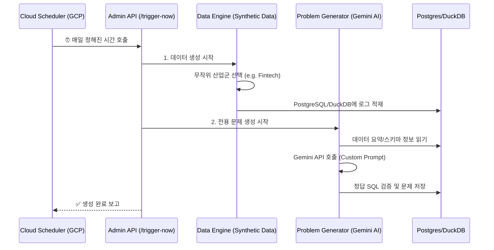

<h1 align="center">QueryCraft: The Frontier of Data Analysis & AI</h1>

  <strong>"오퍼레이터를 넘어 아키텍트로. AI 시대 데이터 분석가를 위한 최고의 훈련소"</strong> 
  QueryCraft는 단순한 플랫폼을 넘어, 비즈니스 영향력을 설계하고 AI와 협업하는 
  <strong>차세대 분석가(Analyst 2.0 & Decision Scientist)</strong>를 위한 완벽한 시뮬레이션 환경을 제공합니다.

  
  
  

---

## 🏛️ Comprehensive Solutions

QueryCraft는 분석가의 실질적인 성장에 집중한 두 가지 트랙과 지능형 분석 시스템을 제공합니다.

### 💎 The Academy (Core Skills)

**현업에서 즉시 성과를 내는 분석가로 진화합니다.**

* **Daily Challenge**: 이커머스, SaaS 등 실제 비즈니스 도메인의 로그 데이터를 기반으로 매일 새로운 과제가 주어집니다. 단순 문법 문제가 아닌, "지난달 대비 매출 하락 요인을 세그먼트별로 분석하라"와 같은 실무형 과제를 SQL로 해결합니다.
* **Strategic KPI Discovery**: 비즈니스의 핵심 지표(NSM, Retention, Funnel)를 직접 정의하고 SQL로 도출하는 과정을 반복하여, 데이터 문해력을 근본적으로 향상시킵니다.
* **AI-Guided Mastery (Code Review)**: 문제를 풀 때마다 시니어 분석가 수준의 AI가 쿼리 작성 능력뿐만 아니라 분석 로직의 정합성, 쿼리 최적화 여부를 실시간으로 평가하고 상세한 피드백을 제공합니다.

### 🧪 The Lab (Future Lab)

**AI와 협업하며 의사결정을 설계하는 미래 분석 환경을 탐험합니다.**

* **Root Cause Analysis (RCA) Simulator**: 매출 급감이나 이탈율 급증과 같은 비즈니스 장애 상황을 시뮬레이션합니다. 기간별/지역별/채널별 비교 분석을 통해 문제의 근본 원인(Root Cause)을 SQL로 추적하고 논리적인 보고서를 작성합니다.
* **AI Analytics Lab (Advanced AI)**: 자연어 질문만으로 복잡한 SQL을 생성하는 **Text-to-SQL**, 쿼리 결과에서 유의미한 비즈니스 액션 아이템을 도출하는 **AI Insight** 등 최신 AI 분석 도구를 직접 도구로서 활용해 봅니다.
* **Adaptive Learning Engine**: 사용자의 오답 패턴을 정밀하게 분석하여 취약한 영역(JOIN, Window Function 등)을 파악하고, 이를 보강하기 위한 맞춤형 학습 경로와 연습 문제를 생성형 AI가 즉석에서 설계합니다.
* **Enterprise connectivity (MCP)**: Cursor, Claude Desktop 등 외부 IDE에서 QueryCraft의 데이터 엔진에 직접 접근하는 차세대 협업 프로토콜을 탑재하여, IDE 환경에서의 분석 경험을 극대화합니다.

---

## 📖 Get Started: The Analyst Journey (User Guide)

QueryCraft에서는 다음과 같은 단계로 분석 역량을 강화할 수 있습니다.

### 1단계: 트랙 선택 (Choose Your Track)

* **Academy**: 정교하게 설계된 비즈니스 시나리오 안에서 정해진 정답(KPI)을 찾아가는 훈련을 원할 때 선택합니다.
* **Lab**: 자유로운 데이터 탐색과 AI 도구 활용, 복합적인 원인 분석(RCA) 등 고도화된 실험을 원할 때 선택합니다.

### 2단계: 실전 분석 사이클 (The Learning Loop)

1. **Context Reading**: AI가 브리핑하는 오늘의 비즈니스 상황과 도메인 데이터 구조를 파악합니다.
2. **SQL Crafting**: 고급 Monaco Editor 환경에서 SQL을 작성합니다. 막힐 때는 AI에게 논리적인 힌트를 요청할 수 있습니다.
3. **Cross-Validation**: 작성한 쿼리를 실행하여 실제 데이터 분포를 확인하고 가설을 검증합니다.
4. **Grading & Review**: 제출 버튼을 눌러 AI의 상세한 코드 리뷰와 분석 관점 피드백을 확인합니다.

### 3단계: 성과 측정 및 성장 (Growth & Analytics)

* 모든 학습 기록은 **Skill Matrix**로 변환되어 대시보드에 기록됩니다.
* 나의 분석 속도, 논리적 정합성, 도메인 이해도를 데이터로 확인하고 다음 학습 경로를 추천받습니다.

---

## 🧐 Why QueryCraft?

AI가 코드를 짜는 시대, 분석가의 가치는 **'어떻게 짜는가'**에서 **'무엇을 해결하는가'**로 이동합니다.

* **Logic over Syntax**: 문법은 AI에게 맡기고, 분석가는 문제 정의와 로직 설계에 집중합니다.
* **Critical Verification**: AI의 결과물을 의심하고 데이터 품질을 수호하는 실전 디버깅 역량을 배양합니다.
* **Scientific Decision Making**: 단순한 수치 보고를 넘어 상업적 의사결정의 과학적 근거를 만드는 법을 터득합니다.

---

## 🔄 Integrated Daily Lifecycle

QueryCraft는 매일 새로운 비즈니스 환경을 자동으로 구축하여 분석가에게 제공합니다.

### 1단계: 트리거 및 산업군 선정 (Selection)
- **GCP Cloud Scheduler**가 백엔드의 `/api/admin/trigger-now` 엔드포인트를 호출합니다.
- 데이터 생성 엔진(`data_generator_advanced.py`)이 동작하며, 오늘 하루 동안 모든 유저가 함께 분석할 **산업군(Product Type)**을 무작위로 선택합니다. (예: 월요일-커머스, 화요일-핀테크...)

### 2단계: 가상 데이터 적재 (Synthetic Data)
- 선택된 산업군에 맞는 시나리오로 사용자들의 가상 행동 로그를 생성합니다.
- **PostgreSQL**: 서비스 메인 데이터 (유저, 주문, 장바구니 등 PA용)
- **DuckDB/Parquet**: 대용량 실시간 이벤트 데이터 (Stream 분석용)
- 이 과정에서 의도적인 **이상 징후(Anomaly)**가 주입되어 나중에 사용자가 RCA(원인 분석) 문제로 풀게 됩니다.

### 3단계: AI 문제 생성 (Double-Loop Generation)
- `problems/generator.py`가 실행됩니다.
- **Prompting**: `prompt.py`는 현재 DB에 쌓인 데이터의 통계(가입자 수, 날짜 범위 등)를 요약하여 Gemini에게 전달합니다. (예: "오늘 핀테크 데이터가 1만 건 있으니, 송금 실패와 관련된 문제를 내줘.")
- **Validation**: Gemini가 문제를 보내주면, 백엔드는 즉시 그 `answer_sql`을 실제 DB에서 실행해 봅니다. 결과가 잘 나오면 '검증된 문제'로 확정합니다.

### 4단계: 유저 인터페이스 접속 (User UX)
- 유저가 접속하면 `MainPage.tsx`가 오늘의 메타데이터를 가져옵니다.
- 화면에는 **"오늘의 산업: 핀테크(Fintech)"**와 같은 정보가 표시됩니다.
- 유저는 **Workspace**로 접근하여, AI가 방금 따끈따끈하게 만들어낸 문제를 풀며 실무 감각을 익히게 됩니다.

---

## 🏗️ Technical Excellence

QueryCraft는 최고의 기술적 완성도를 통해 전문적인 분석 환경을 구현합니다.

* **Intelligence**: Gemini 2.0 Flash 모델을 기반으로 한 실시간 도메인 생성 및 고도화된 SQL 채점 엔진.
* **Performance**: 대용량 가산 데이터를 실시간으로 조회하고 처리하기 위한 DuckDB 인메모리 엔진 탑재.
* **Connectivity**: 외부 AI 에이전트가 데이터에 직접 접근할 수 있도록 설계된 차세대 MCP(Model Context Protocol) 지원.
* **Design**: 분석에 몰입할 수 있도록 설계된 Arcade 스타일의 고품질 UI 및 반응형 에디터 환경.

---

## 📖 Documentation

운영 및 기술 가이드에 대한 상세 내용은 아래 문서를 참조하세요. 로컬 개발 환경 구축에 대한 내용은 `DEVELOPMENT_GUIDE.md`로 일원화되었습니다.

* [**WIKI_INDEX.md**](./docs/WIKI_INDEX.md): 모든 문서의 중앙 목차.
* [**REFERENCE_WIKI.md**](./docs/REFERENCE_WIKI.md): 서비스 상세 가이드.
* [**TECH_WIKI.md**](./docs/TECH_WIKI.md): 시스템 아키텍처 및 구현 명세.
* [**DEVELOPMENT_GUIDE.md**](./docs/DEVELOPMENT_GUIDE.md): 개발자용 로컬 설정 가이드.

---

Copyright © 2026 QueryCraft Team. All rights reserved.
