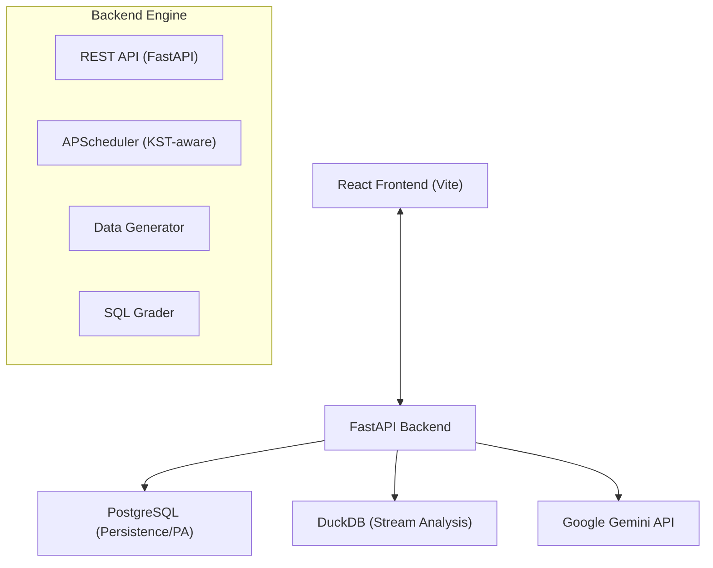

# QueryCraft

> 프로덕트 분석가 양성을 위한 AI 기반 SQL 실습 플랫폼

QueryCraft는 실무 데이터 분석 환경을 시뮬레이션하여 사용자가 SQL을 통해 비즈니스 인사이트를 도출하는 역량을 키울 수 있도록 돕는 학습 플랫폼입니다.

---

## 🚀 주요 특징 (Key Features)

- **AI 기반 문제 생성 & 피드백**: Google Gemini Pro를 활용하여 매일 새로운 분석 문제를 생성하고, 사용자의 SQL에 대해 시니어 분석가 관점의 코드 리뷰를 제공합니다.
- **5가지 프로덕트 타입**: 커머스, 콘텐츠, SaaS, 커뮤니티, 핀테크 등 다양한 도메인의 가상 데이터를 제공합니다.
- **통합 KST(Asia/Seoul) 아키텍처**: 서버 환경(UTC 등)과 관계없이 모든 비즈니스 로직과 데이터 처리가 한국 표준시를 기준으로 일관되게 작동합니다.
- **실시간 로그 분석 (Stream)**: 정적 데이터(PA)뿐만 아니라 초 단위로 발생하는 이벤트 데이터를 분석하는 실전형 시나리오를 제공합니다.
- **PostgreSQL 기반 실무 환경**: 실제 협업 환경에서 가장 많이 쓰이는 PostgreSQL 문법을 기본으로 하며, 대용량 분석을 위한 DuckDB를 결합한 하이브리드 구조입니다.

---

## 🏗️ 시스템 아키텍처 (Architecture)

### All-in-One Backend
QueryCraft의 백엔드는 단순한 API 서버를 넘어 데이터 생성, 채점, 스케줄링을 통합 관리하는 엔진입니다.



### 핵심 설계 원칙
1.  **KST Unified**: `backend/common/date_utils.py`를 통해 모든 시간 계산을 KST로 통일하여 GCP 등 UTC 기반 클라우드 환경에서도 날짜 오프셋 없이 작동합니다.
2.  **Integrated Scheduler**: 별도의 워커 컨테이너 없이 백엔드 내부에서 `APScheduler`를 통해 매일 문제 생성 및 데이터 갱신을 수행합니다.
3.  **Hybrid Data Store**: 유저 데이터 및 메타데이터는 PostgreSQL에, 대규모 이벤트 분석은 DuckDB를 사용하여 성능과 관리 편의성을 동시에 잡았습니다.

---

## 🛠️ 기술 스택 (Tech Stack)

### Frontend
- **React 18 / Vite / TypeScript**
- **Monaco Editor**: SQL 편집기
- **Mixpanel & PostHog**: 유저 행동 로그 분석

### Backend
- **Python 3.12+ / FastAPI**
- **APScheduler**: 내부 작업 스케줄링
- **Pytz**: 타임존 관리 (Asia/Seoul)
- **Pandas**: 데이터 처리 및 SQL 결과 검증

### Database & AI
- **PostgreSQL**: 유저, 제출 이력, PA 데이터
- **DuckDB**: 스트림 이벤트 및 분석용 데이터
- **Google Gemini 2.5 Pro**: 문제 생성 및 AI 피드백

---

## 📂 프로젝트 구조 (Project Structure)

```text
/backend          # FastAPI 서버, 스케줄러, 채점 및 데이터 생성 엔진
/frontend         # React SPA 소스 코드
/problems         # AI 문제 생성을 위한 프롬프트 및 로직
/docs             # 상세 가이드 및 배포 문서
/scripts          # 관리자용 유틸리티 스크립트
docker-compose.yml # 전체 서비스 오케스트레이션
```

---

## 🏁 시작하기 (Getting Started)

### 1. 환경 설정
`.env` 파일을 생성하고 필수 값을 입력합니다. (Gemini API 키 필수)

```bash
cp .env.example .env
# GEMINI_API_KEY=...
```

### 2. 서비스 실행
Docker Compose를 통해 백엔드와 프론트엔드를 동시에 실행합니다.

```bash
docker compose up -d
```

- **Frontend**: `http://localhost:15173`
- **Backend API Docs**: `http://localhost:15174/docs`

### 3. 초기 데이터 및 문제 생성 (관리자)
```bash
# PA 데이터 및 오늘자 문제 생성
docker compose exec backend python -c "from backend.api.admin import initial_setup; initial_setup()"
```

---

## 📖 관련 문서 (Documentation)

- [GCP 배포 가이드](docs/GCP_DEPLOYMENT_GUIDE.md): GCP 무료 티어 기반 운영 방법
- [분석 트래킹 계획](docs/KPI_TRACKING_PLAN.md): 지표 정의 및 이벤트 설계
- [이벤트 트래킹 가이드](docs/EVENT_TRACKING_GUIDE.md): Mixpanel/PostHog 구현 및 관리
- [DB 스키마 상세](docs/WALKTHROUGH.md): 최신 DB 테이블 및 컬럼 명세

---

## ⚠️ 주의사항

- **PostgreSQL 전용**: 현재 모든 실습 쿼리는 PostgreSQL 문법에 최적화되어 있습니다. Oracle이나 MySQL과는 일부 함수(예: `DATE_TRUNC`, `ROUND`의 numeric 캐스팅 등) 차이가 있을 수 있습니다.
- **KST 기준**: 모든 날짜는 한국 표준시(KST)를 기준으로 생성되고 로드됩니다.

---

**QueryCraft와 함께 프로덕트 분석가의 길을 시작해보세요! 🚀**
