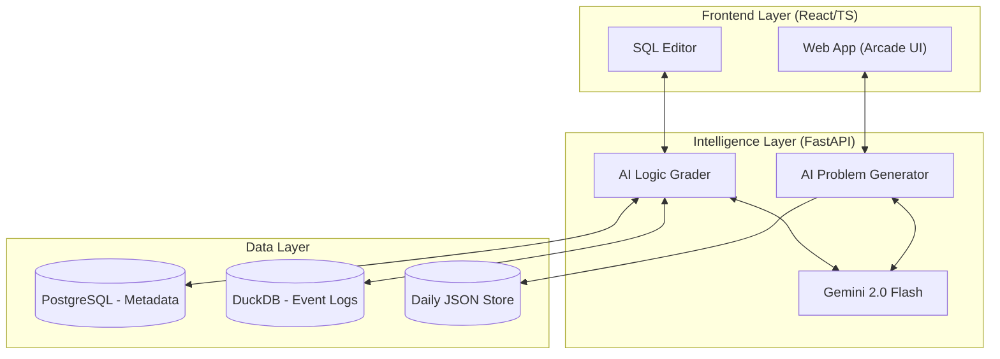

<!-- <p align="center">
  
</p> -->

<h1 align="center">QueryCraft (쿼리크래프트)</h1>

<p align="center">
  <strong>"AI와 공존하며 의사결정의 심장부로 도약하는 데이터 분석가의 훈련소"</strong><br />
  SQL 문법을 넘어, AI라는 강력한 무기를 제어하고 비즈니스 임팩트를 설계하는<br />
  <strong>Analyst 2.0 & Decision Scientist</strong>로의 여정을 시작하세요.
</p>

<p align="center">
  
  
  
  
  
  
</p>

---

## 🧐 AI 시대, 왜 QueryCraft인가?

단순히 쿼리를 짤 줄 아는 '오퍼레이터(Operator)'는 AI로 대체됩니다. 하지만 비즈니스 로직을 설계하고 AI의 결과물을 검증하며 전략적 제안을 던지는 **'아키텍트(Architect)'**는 대체 불가능합니다.

QueryCraft는 분석가가 AI 시대를 정복할 수 있도록 돕는 유일한 시뮬레이션 환경입니다.

- **Logic over Syntax**: 쿼리 작성은 AI에게 맡기고(Text-to-SQL), 분석가는 문제 정의와 로직 설계에 집중합니다.
- **Critical QA (The Guardian)**: AI가 범할 수 있는 논리적 오류를 찾아내고 데이터 품질을 수호하는 실전 디버깅 훈련을 제공합니다.
- **RCA & Decision Science**: 매일 발생하는 가상의 비즈니스 장애 상황(RCA)을 해결하며, 의사결정의 과학적 근거를 만드는 법을 배웁니다.

---

## 🌟 핵심 기능 (Key Features)

### 2-Track 실무 가이드

- **Track A: Core Skills**: 필수적인 SQL 기술과 데이터 도메인에 대한 깊은 이해도를 쌓습니다.
- **Track B: Future Lab**: AI 에이전트 협업, MCP 연동, 자동 인사이트 추출 등 최신 AI 분석 기술을 실험합니다.

| Feature | Description |
| :--- | :--- |
| **🤖 Problem Engine** | Gemini 2.0 Flash가 매일 각기 다른 비즈니스 상황을 설정하고 6개의 도전을 출제합니다. |
| **🏬 KPI Simulation** | 커머스, SaaS, 핀테크 등 각 산업별 북스타 메트릭(NSM)을 반영한 가상 도메인을 제공합니다. |
| **💡 AI Deep Feedback** | 시니어 분석가의 관점에서 당신의 분석 로직이 비즈니스적으로 어떤 임팩트를 미치는지 평가합니다. |
| **⚡ Real-time Analytics** | **DuckDB**를 활용하여 초고속 로그 분석 환경을 시뮬레이션합니다. |
| **🔌 MCP Integration** | AI가 실제 데이터 스키마를 인지하고 실시간 가이드를 제공하는 차세대 프로토콜을 탑재했습니다. |

---

## 🏗️ 시스템 아키텍처



---

## 📂 프로젝트 구조

프로젝트 관리는 전문화된 **Wiki 시스템**을 통해 이루어집니다.

```text
QueryCraft/
├── 📂 backend/       # FastAPI 서버 및 AI 생성기 엔진
├── 📂 frontend/      # React/TS 웹 애플리케이션 (Arcade Style)
├── 📂 docs/          # 통합 Wiki 및 서비스 마스터 플랜 (가장 중요!)
├── 📂 shared/        # 도메인 모델 및 유틸리티 공용 코드
└── 📂 tests/         # 품질 보증을 위한 통합 테스트 슈트
```

> [!IMPORTANT]
> **상세 문서는 Wiki를 확인하세요!**
> - 비즈니스/기능 가이드: [**REFERENCE_WIKI.md**](./docs/REFERENCE_WIKI.md)
> - 기술 명세/아키텍처: [**TECH_WIKI.md**](./docs/TECH_WIKI.md)
> - 미래 전략/로드맵: [**FUTURE_PLAN.md**](./docs/FUTURE_PLAN.md)

> [!TIP]
> **WIKI INDEX**: 모든 가이드의 목차는 [**docs/WIKI_INDEX.md**](./docs/WIKI_INDEX.md)에서 확인하실 수 있습니다.

---

## 🚀 시작하기

### 📝 환경 설정

`.env` 파일을 생성하고 Google Gemini API 키를 설정하세요.

```bash
cp .env.example .env
# GEMINI_API_KEY=your_key_here
```

### 🐳 서비스 실행 (Docker)

Docker Compose로 프론트엔드, 백엔드, DB를 한 번에 실행합니다.

```bash
docker compose up -d
```

- **Web**: `http://localhost:15173`
- **API Docs**: `http://localhost:15174/docs`

### 🏗️ 초기 셋업

실습을 위한 기초 데이터와 오늘자 문제를 생성합니다.

```bash
docker compose exec backend python -c "from backend.api.admin import initial_setup; initial_setup()"
```

---

## 🤝 라이선스 및 저작권

이 프로젝트는 MIT 라인선스 하에 배포됩니다.
Copyright © 2026 QueryCraft Team. All rights reserved.
