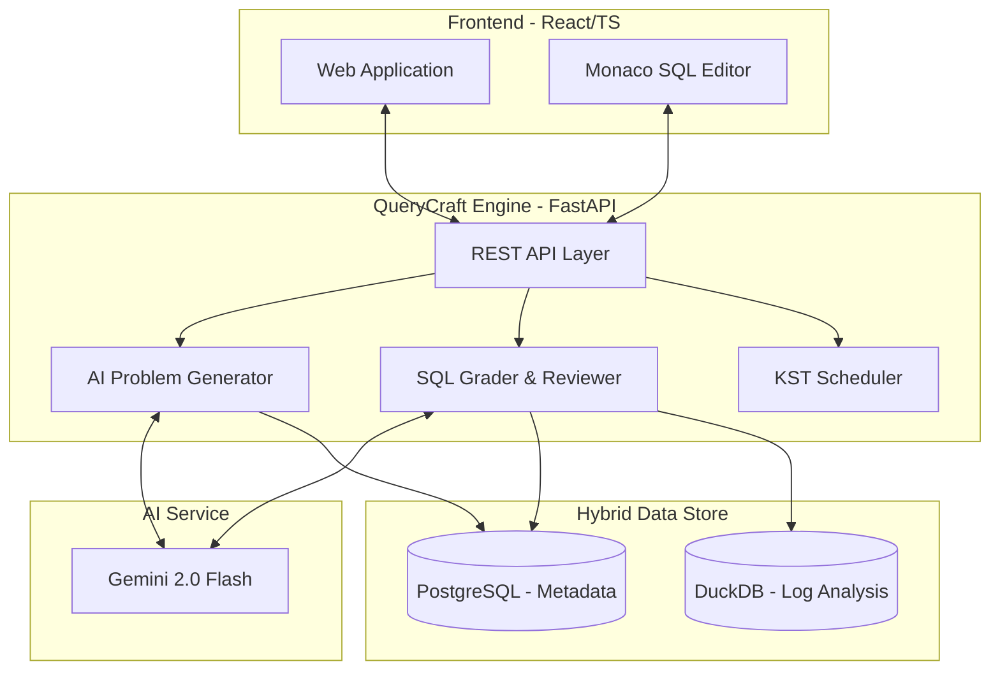

<p align="center">
  
</p>

<h1 align="center">QueryCraft (쿼리크래프트)</h1>

<p align="center">
  <strong>"단순한 SQL 문법을 넘어, 비즈니스를 읽는 데이터 분석가로"</strong><br />
  실무 데이터 환경을 완벽히 시뮬레이션하고, AI가 생성한 고도화된 문제와 피드백을 통해<br />
  현업 시니어 분석가 수준의 문제 해결 역량을 쌓으세요.
</p>

<p align="center">
  
  
  
  
  
  
</p>

---

## 🧐 Why QueryCraft?

대부분의 SQL 강의는 `SELECT`, `JOIN` 등 문법 교육에 치중합니다. 하지만 실무 분석가에게 필요한 역량은 **우리 프로젝트의 리텐션이 왜 떨어졌을까**와 같은 비즈니스 질문을 SQL로 변환하는 능력입니다.

QueryCraft는 이 간극을 메우기 위해 탄생했습니다.

1.  **Context-Driven Learning**: "회원가입 후 7일 이내 구매하지 않은 유저의 이탈 분석"과 같은 구체적인 실무 시나리오를 제공합니다.
2.  **No More Tutorial Hell**: 정적이고 반복적인 데이터셋이 아닌, 매일 새롭게 바뀌는 동적 데이터와 문제를 통해 실전 기각을 극대화합니다.
3.  **Senior Analyst in Your Pocket**: Google Gemini API를 활용하여, 당신의 쿼리가 왜 실무적으로 위험한지, 혹은 어떻게 더 효율적으로 개선할 수 있는지 시니어 분석가의 관점에서 피드백합니다.

---

## 🌟 주요 특징 (Key Features)

| Feature | Description |
| :--- | :--- |
| **🤖 AI Daily Generation** | Gemini 2.0 Flash가 매일 각기 다른 비즈니스 상황을 설정하고, 그에 최적화된 6개의 분석 과제를 출제합니다. |
| **🏬 5개 산업군 특화 데이터** | 커머스, SaaS, 핀테크 등 각 산업별 핵심 KPI(North Star Metric)를 반영한 가상 데이터 구조를 시뮬레이션합니다. |
| **⏰ KST Integration** | 글로벌 클라우드 환경에서도 모든 데이터 집계와 스케줄링이 한국 표준시(KST) 기준으로 정확히 작동하도록 설계되었습니다. |
| **⚡ Hybrid Data Store** | 안정적인 메타데이터 관리를 위한 **PostgreSQL**과 대용량 로그 분석 성능을 위한 **DuckDB**의 장점을 결합했습니다. |
| **💡 Interactive Editor** | 전용 Monaco Editor를 통해 테이블 스키마에 기반한 스마트 자동완성과 쿼리 실행 환경을 제공합니다. |

---

## 🏗️ 시스템 아키텍처 (Architecture)

QueryCraft는 확장 가능하고 안정적인 현대적 웹 아키텍처를 지향합니다.



---

## 📡 데이터 도메인 및 분석 목표 (Domains)

QueryCraft가 제공하는 5가지 가상 기업을 통해 각 분야의 핵심 데이터를 마스터하세요.

- 🛒 **TrendPick (이커머스)**
  - **목표**: 구매 퍼널 최적화 및 리텐션 강화
  - **핵심 데이터**: 주문, 장바구니, 유입 채널, 쿠폰 사용 이력
- ☁️ **TaskSync (B2B SaaS)**
  - **목표**: 무료 유저의 유료 전환(Upgrade) 및 Churn 방지
  - **핵심 데이터**: 기능 Adoption, 온보딩 성공률, API 호출량, 유료 플랜
- 📱 **InsightFlow (콘텐츠)**
  - **목표**: 유저 인게이지먼트 및 구독 갱신율 분석
  - **핵심 데이터**: 콘텐츠 완독률(Scroll Depth), 읽기 시간, 공유, 북마크
- 🤝 **HobbyLink (커뮤니티)**
  - **목표**: 활성 생산자(Creator) 확보 및 네트워크 선순환 분석
  - **핵심 데이터**: 포스팅 생성, 댓글/좋아요 인터랙션, 팔로우 네트워크
- 💳 **SafePay (핀테크)**
  - **목표**: 거래 성공률 관리 및 이상 거래(Fraud) 탐지
  - **핵심 데이터**: 송금 시도/성공/실패 로그, KYC 완료율, 카드 결제

---

## 📂 프로젝트 구조 (Structure)

```text
QueryCraft/
├── 📂 backend/       # FastAPI 서버 및 비즈니스 로직
│   ├── 📂 api/       # REST API 엔드포인트
│   ├── 📂 engine/    # DB 최적화 실행 엔진 (PG/DuckDB)
│   └── 📂 services/  # 채점, AI 피드백, 세션 관리 서비스
├── 📂 frontend/      # React SPA (Vite, TS)
│   ├── 📂 src/components # UI 컴포넌트 (Editor, Results)
│   └── 📂 src/services   # API 및 Analytics 연동
├── 📂 problems/      # AI 문제 생성 프롬프트 엔지니어링 및 템플릿
├── 📂 shared/        # 백엔드/서비스 간 공용 코드
└── 📂 docker/        # 배포 및 환경 설정
```

---

## 🚀 시작하기 (Getting Started)

### 1. 환경 설정 (Environment)
`.env` 파일을 생성하고 Google Gemini API 키를 설정합니다.

```bash
cp .env.example .env
# GEMINI_API_KEY=your_key_here
```

### 2. 서비스 실행 (Docker)
Docker Compose를 사용하여 전체 서비스를 즉시 시작할 수 있습니다.

```bash
docker compose up -d
```

* **Frontend**: [http://localhost:15173](http://localhost:15173)
* **API Docs**: [http://localhost:15174/docs](http://localhost:15174/docs)

### 3. 초기 데이터 셋업 (Initial Setup)
최초 실행 시 실습용 기초 데이터와 문제를 생성해야 합니다.

```bash
docker compose exec backend python -c "from backend.api.admin import initial_setup; initial_setup()"
```

---

## 🛠️ 기술 명세 (Tech Specs)

- **Backend**: Python 3.12, FastAPI, Pandas, SQLAlchemy
- **Frontend**: React 18, TypeScript, Vite, Monaco Editor
- **Database**: PostgreSQL (User/Meta), DuckDB (Large-scale Events)
- **AI**: Google Generative AI (Gemini 2.0 Flash)
- **Infrastructure**: Docker, GCP Cloud Run, GitHub Actions

---

## 📄 라이선스 (License)

이 프로젝트는 MIT 라이선스 하에 배포됩니다.

<p align="center">
  Copyright © 2026 QueryCraft Team. All rights reserved.
</p>
