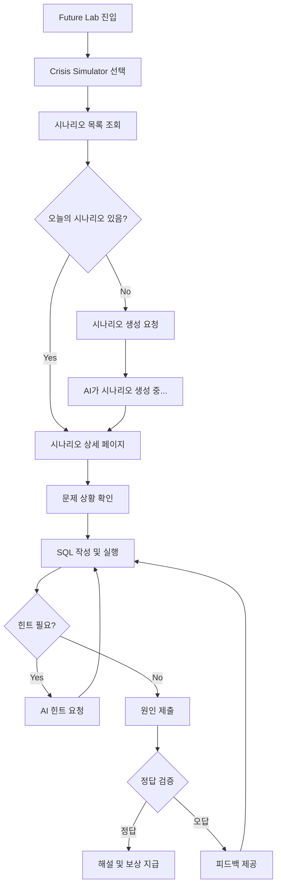
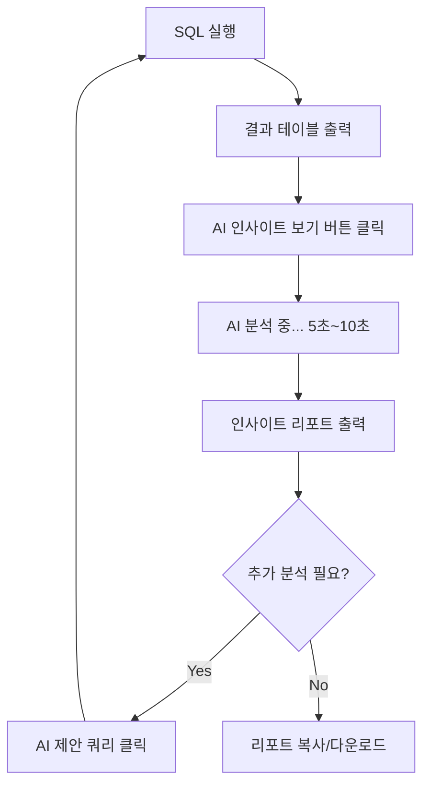
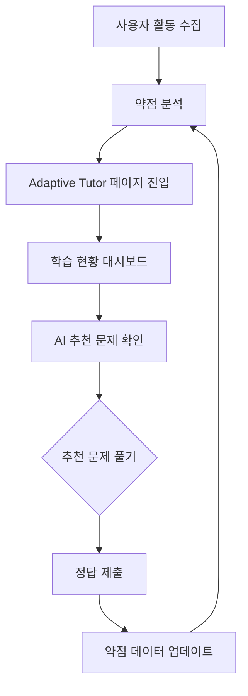
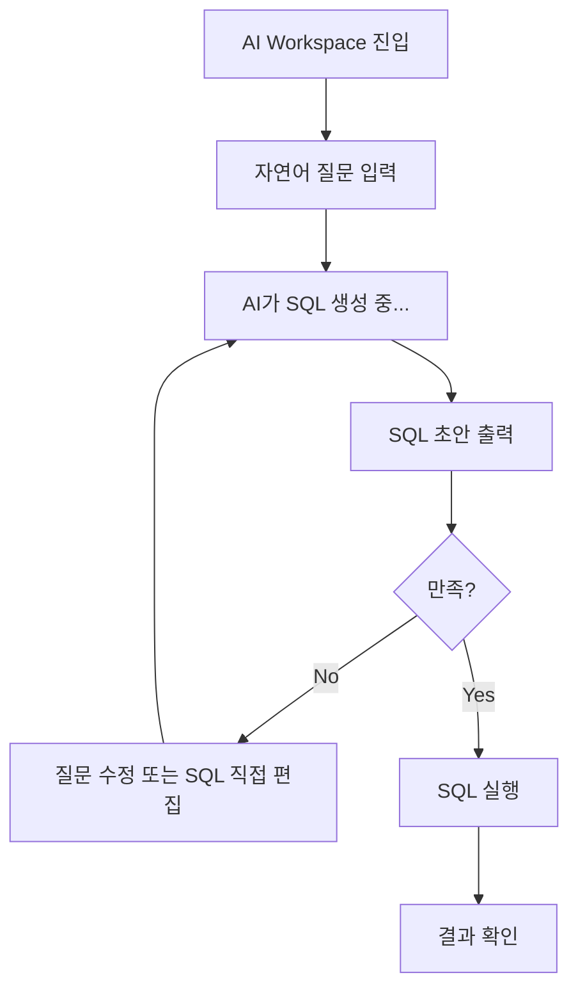
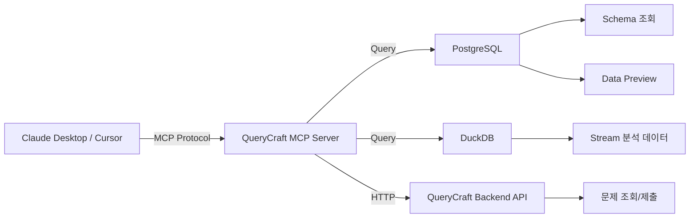

# QueryCraft Future Lab AI 기능 상세 기획서

> **작성일**: 2026-01-15  
> **목적**: Future Lab의 5가지 AI 기능 구현을 위한 상세 기획  
> **기반 문서**: [FUTURE_ROADMAP.md](./FUTURE_ROADMAP.md)

---

## 목차

1. [RCA 시나리오 모드](#1-rca-시나리오-모드)
2. [AI 인사이트 리포트](#2-ai-인사이트-리포트)
3. [개인화 학습 추천 (Adaptive Tutor)](#3-개인화-학습-추천)
4. [Text-to-SQL (AI Workspace)](#4-text-to-sql-ai-workspace)
5. [MCP 연동](#5-mcp-연동)
6. [구현 우선순위 및 로드맵](#6-구현-우선순위-및-로드맵)

---

# 1. RCA 시나리오 모드

## 1.1 개요

**컨셉**: "비즈니스 장애 상황 시뮬레이션"  
**목표**: 실무에서 발생하는 매출 급감, 리텐션 하락 등의 장애를 재현하고, 사용자가 SQL로 원인을 분석하는 훈련

## 1.2 사용자 플로우



## 1.3 UI/UX 설계

### 1.3.1 시나리오 목록 페이지

```
┌────────────────────────────────────────┐
│  🚨 Crisis Simulator                   │
├────────────────────────────────────────┤
│                                        │
│  📅 오늘의 위기                         │
│  ┌──────────────────────────────────┐ │
│  │ 2026-01-15                       │ │
│  │ 🔥 결제 전환율 35% 급락           │ │
│  │ 난이도: ⭐⭐⭐                     │ │
│  │ 보상: 50 XP                       │ │
│  │                                  │ │
│  │ [시작하기 →]                      │ │
│  └──────────────────────────────────┘ │
│                                        │
│  📚 지난 시나리오 (선택 학습)           │
│  ┌──────────────────────────────────┐ │
│  │ 2026-01-14: DAU 20% 하락         │ │
│  │ ✅ 완료 | 정답률: 45%             │ │
│  └──────────────────────────────────┘ │
│  ┌──────────────────────────────────┐ │
│  │ 2026-01-13: 리텐션 급감           │ │
│  │ ⏭️ 미완료                         │ │
│  └──────────────────────────────────┘ │
└────────────────────────────────────────┘
```

### 1.3.2 시나리오 상세 페이지

```
┌────────────────────────────────────────────────┐
│  🔥 결제 전환율 35% 급락                        │
│  난이도: ⭐⭐⭐ | 보상: 50 XP                   │
├────────────────────────────────────────────────┤
│                                                │
│  📋 상황                                        │
│  2025년 12월 셋째 주, 결제 전환율이 전주 대비   │
│  35% 급락했습니다. 무엇이 원인인지 분석하고     │
│  보고서를 작성해주세요.                         │
│                                                │
│  📊 주요 지표                                   │
│  - 전주 전환율: 8.5%                           │
│  - 금주 전환율: 5.5%                           │
│  - 영향받은 사용자: ~3,000명                   │
│                                                │
│  💡 제공 데이터                                 │
│  - pa_events (사용자 이벤트)                   │
│  - pa_users (사용자 정보)                      │
│  - pa_transactions (거래 기록)                 │
│                                                │
├────────────────────────────────────────────────┤
│  SQL Editor                    [💡 힌트 요청]  │
│  ┌──────────────────────────────────────────┐ │
│  │ SELECT ...                               │ │
│  │                                          │ │
│  └──────────────────────────────────────────┘ │
│  [▶ 실행]                                      │
│                                                │
│  📈 결과                                        │
│  ┌──────────────────────────────────────────┐ │
│  │ (쿼리 실행 결과 테이블)                   │ │
│  └──────────────────────────────────────────┘ │
│                                                │
│  🎯 원인 제출                                   │
│  ┌──────────────────────────────────────────┐ │
│  │ 원인: [              ]                   │ │
│  │       예) "iOS 결제 버튼 오류"            │ │
│  │                                          │ │
│  │ 근거 SQL: 위에서 작성한 쿼리가 자동 첨부   │ │
│  └──────────────────────────────────────────┘ │
│  [제출하기]                                    │
└────────────────────────────────────────────────┘
```

## 1.4 API 설계

### 1.4.1 엔드포인트

| Method | Endpoint | 설명 |
|--------|----------|------|
| GET | `/rca/scenarios` | 시나리오 목록 조회 |
| GET | `/rca/scenarios/{date}` | 특정 날짜 시나리오 상세 |
| POST | `/rca/scenarios/generate` | 새 시나리오 생성 (관리자/스케줄러) |
| POST | `/rca/hint` | AI 힌트 요청 |
| POST | `/rca/submit` | 답안 제출 및 검증 |

### 1.4.2 데이터 구조

**Request: POST /rca/scenarios/generate**
```json
{
  "date": "2026-01-15",
  "difficulty": "medium",
  "data_type": "pa"
}
```

**Response:**
```json
{
  "scenario_id": "rca_20260115",
  "date": "2026-01-15",
  "title": "결제 전환율 35% 급락",
  "description": "2025년 12월 셋째 주...",
  "difficulty": "medium",
  "xp_reward": 50,
  "context": {
    "metric": "conversion_rate",
    "baseline": 8.5,
    "current": 5.5,
    "timeframe": "2025-12-15 ~ 2025-12-21"
  },
  "hidden_truth": {
    "cause": "ios_payment_button_bug",
    "affected_segment": "WHERE platform = 'iOS' AND version = '2.1.0'"
  }
}
```

**Request: POST /rca/submit**
```json
{
  "scenario_id": "rca_20260115",
  "user_answer": "iOS 결제 버튼 오류",
  "sql": "SELECT platform, version, COUNT(*) as failed_payments..."
}
```

**Response:**
```json
{
  "correct": true,
  "score": 95,
  "feedback": "정확합니다! iOS 버전 2.1.0의 결제 버튼 이슈를 발견했습니다.",
  "xp_earned": 50,
  "solution": {
    "cause": "ios_payment_button_bug",
    "explanation": "12월 18일 배포된 iOS 앱 v2.1.0에서...",
    "recommended_sql": "SELECT ..."
  }
}
```

## 1.5 데이터 모델

### 1.5.1 PostgreSQL 테이블

```sql
CREATE TABLE rca_scenarios (
    scenario_id TEXT PRIMARY KEY,
    date DATE NOT NULL,
    title TEXT NOT NULL,
    description TEXT,
    difficulty TEXT CHECK (difficulty IN ('easy', 'medium', 'hard')),
    data_type TEXT DEFAULT 'pa',
    xp_reward INTEGER DEFAULT 50,
    context JSONB,  -- 문제 상황 메타데이터
    hidden_truth JSONB,  -- 정답 데이터 (사용자에게 노출 안 됨)
    created_at TIMESTAMP DEFAULT NOW()
);

CREATE TABLE rca_submissions (
    id SERIAL PRIMARY KEY,
    user_id TEXT NOT NULL,
    scenario_id TEXT NOT NULL REFERENCES rca_scenarios(scenario_id),
    user_answer TEXT,
    sql TEXT,
    correct BOOLEAN,
    score INTEGER,
    xp_earned INTEGER,
    submitted_at TIMESTAMP DEFAULT NOW()
);

CREATE INDEX idx_rca_submissions_user ON rca_submissions(user_id);
CREATE INDEX idx_rca_submissions_scenario ON rca_submissions(scenario_id);
```

## 1.6 AI 프롬프트 설계

### 1.6.1 시나리오 생성 프롬프트

```
당신은 데이터 분석가를 위한 RCA(Root Cause Analysis) 시나리오를 생성하는 전문가입니다.

**목표**: 오늘 날짜({date})에 발생할 가상의 비즈니스 장애 상황을 만드세요.

**요구사항**:
1. 난이도: {difficulty} (easy, medium, hard)
2. 데이터셋: PA (Product Analytics) 데이터
3. 장애 유형: 매출 감소, 전환율 하락, 리텐션 감소, DAU 급감 중 하나 선택
4. 원인: 명확한 하나의 근본 원인 (예: 특정 플랫폼 버그, 마케팅 채널 이슈 등)

**출력 형식** (JSON):
{{
  "title": "한 줄 요약 (예: 결제 전환율 35% 급락)",
  "description": "상황 설명 (2-3문장)",
  "context": {{
    "metric": "측정 지표 (예: conversion_rate)",
    "baseline": 정상 수치,
    "current": 현재 수치,
    "timeframe": "분석 기간"
  }},
  "hidden_truth": {{
    "cause": "원인 키워드 (예: ios_payment_button_bug)",
    "affected_segment": "SQL WHERE 조건 (예: platform = 'iOS')",
    "explanation": "왜 이 원인이 발생했는지 설명"
  }}
}}
```

### 1.6.2 힌트 생성 프롬프트

```
사용자가 RCA 시나리오를 풀고 있습니다. 막혔을 때 도움이 되는 힌트를 제공하세요.

**시나리오**: {scenario_description}
**숨겨진 정답**: {hidden_truth}
**사용자가 작성한 SQL**: {user_sql}

**규칙**:
1. 정답을 직접 알려주지 마세요
2. 다음 단계를 제시하세요 (예: "이 테이블의 platform 컬럼을 확인해보세요")
3. 사용자가 놓친 부분을 암시하세요

**출력**: 힌트 텍스트 (2-3문장)
```

---

# 2. AI 인사이트 리포트

## 2.1 개요

**컨셉**: "SQL 결과 → 비즈니스 인사이트 자동 생성"  
**목표**: 데이터 분석 후 리포트 작성 시간 80% 단축

## 2.2 사용자 플로우



## 2.3 UI/UX 설계

### 2.3.1 인사이트 버튼 추가

```
┌────────────────────────────────────────┐
│  SQL Editor                            │
│  ┌──────────────────────────────────┐  │
│  │ SELECT ...                       │  │
│  └──────────────────────────────────┘  │
│  [▶ 실행] [💡 AI 인사이트 보기]        │
│                                        │
│  📊 결과 (25 rows)                     │
│  ┌──────────────────────────────────┐  │
│  │ date      | revenue | users      │  │
│  │ 2026-01-01| 125,000 | 2,340     │  │
│  │ ...                              │  │
│  └──────────────────────────────────┘  │
└────────────────────────────────────────┘
```

### 2.3.2 인사이트 리포트 모달

```
┌───────────────────────────────────────────┐
│  🤖 AI 인사이트 리포트        [✕]         │
├───────────────────────────────────────────┤
│                                           │
│  📌 핵심 발견 (Key Findings)               │
│  1. 1월 1주차 매출이 전주 대비 15% 증가    │
│  2. 신규 사용자 유입이 2,340명으로 최고치   │
│  3. iOS 사용자의 객단가가 Android보다      │
│     23% 높음                              │
│                                           │
│  💡 인사이트 (Business Insight)            │
│  - 연휴 시즌 마케팅 효과가 뚜렷하게 나타남  │
│  - iOS 사용자 타겟팅 강화 필요             │
│                                           │
│  🎯 추천 액션 (Action Items)               │
│  1. iOS 전용 프로모션 기획                 │
│  2. 신규 유입 채널 분석 확대               │
│                                           │
│  🔍 추가 분석 제안                         │
│  [클릭하여 실행 →]                         │
│  - 일별 리텐션 트렌드 분석                 │
│  - 채널별 ROAS 계산                        │
│                                           │
│  [📋 복사] [⬇ 다운로드 (.md)]              │
└───────────────────────────────────────────┘
```

## 2.4 API 설계

### 2.4.1 엔드포인트

| Method | Endpoint | 설명 |
|--------|----------|------|
| POST | `/sql/insight` | SQL 결과 → AI 인사이트 생성 |

### 2.4.2 데이터 구조

**Request:**
```json
{
  "problem_id": "pa_20260115_01",
  "sql": "SELECT date, SUM(revenue) as total_revenue...",
  "results": [
    {"date": "2026-01-01", "revenue": 125000, "users": 2340},
    {"date": "2026-01-02", "revenue": 118000, "users": 2210}
  ],
  "data_type": "pa"
}
```

**Response:**
```json
{
  "key_findings": [
    "1월 1주차 매출이 전주 대비 15% 증가",
    "신규 사용자 유입이 2,340명으로 최고치"
  ],
  "insights": [
    "연휴 시즌 마케팅 효과가 뚜렷하게 나타남"
  ],
  "action_items": [
    "iOS 전용 프로모션 기획",
    "신규 유입 채널 분석 확대"
  ],
  "suggested_queries": [
    {
      "title": "일별 리텐션 트렌드 분석",
      "sql": "SELECT date, COUNT(DISTINCT user_id)..."
    }
  ],
  "report_markdown": "# AI 인사이트 리포트\n\n## 핵심 발견..."
}
```

## 2.5 AI 프롬프트 설계

```
당신은 데이터 분석 결과를 비즈니스 인사이트로 변환하는 전문가입니다.

**입력 데이터**:
```
{results_table}
```

**실행한 SQL**:
```sql
{sql}
```

**요구사항**:
1. **핵심 발견 (Key Findings)**: 데이터에서 발견한 정량적 사실 3가지
2. **비즈니스 인사이트**: 발견의 의미와 배경 해석
3. **추천 액션**: 구체적이고 실행 가능한 액션 아이템
4. **추가 분석 제안**: 더 깊이 파고들 수 있는 SQL 쿼리 제안

**출력 형식**: JSON
{{
  "key_findings": ["문장1", "문장2", "문장3"],
  "insights": ["인사이트1", "인사이트2"],
  "action_items": ["액션1", "액션2"],
  "suggested_queries": [
    {{"title": "제목", "sql": "쿼리"}}
  ]
}}
```

---

# 3. 개인화 학습 추천 (Adaptive Tutor)

## 3.1 개요

**컨셉**: "사용자 약점 분석 → 맞춤형 문제 추천"  
**목표**: 학습 효율 2배 증가 (약점 집중 학습)

## 3.2 사용자 플로우



## 3.3 UI/UX 설계

### 3.3.1 Adaptive Tutor 대시보드

```
┌─────────────────────────────────────────────┐
│  🎓 Adaptive Tutor                          │
├─────────────────────────────────────────────┤
│                                             │
│  📊 내 학습 현황                             │
│  ┌─────────────────────────────────────┐   │
│  │ 레벨: 5 | XP: 340/500               │   │
│  │ 해결한 문제: 42개                    │   │
│  │ 정답률: 78%                          │   │
│  └─────────────────────────────────────┘   │
│                                             │
│  🔍 AI가 발견한 약점                         │
│  ┌─────────────────────────────────────┐   │
│  │ 🔴 JOIN (특히 LEFT JOIN)            │   │
│  │    오답률: 60% | 평균 풀이 시간: 8분  │   │
│  │                                     │   │
│  │ 🟡 윈도우 함수                       │   │
│  │    오답률: 45% | 평균 풀이 시간: 6분  │   │
│  │                                     │   │
│  │ 🟢 GROUP BY                         │   │
│  │    정답률: 90% (우수)                │   │
│  └─────────────────────────────────────┘   │
│                                             │
│  💡 오늘의 추천 문제                         │
│  ┌─────────────────────────────────────┐   │
│  │ 📝 "사용자별 구매 빈도 분석"          │   │
│  │ 난이도: ⭐⭐ (Medium)                 │   │
│  │ 주제: LEFT JOIN 연습                 │   │
│  │                                     │   │
│  │ 💬 왜 추천?                          │   │
│  │ "최근 JOIN 문제에서 오답률이 높았어요.│   │
│  │  이 문제로 기초를 다시 다져보세요!"  │   │
│  │                                     │   │
│  │ [시작하기 →]                         │   │
│  └─────────────────────────────────────┘   │
│                                             │
│  📈 성장 추이                                │
│  ┌─────────────────────────────────────┐   │
│  │ (차트: 주차별 정답률 트렌드)          │   │
│  └─────────────────────────────────────┘   │
└─────────────────────────────────────────────┘
```

## 3.4 API 설계

### 3.4.1 엔드포인트

| Method | Endpoint | 설명 |
|--------|----------|------|
| GET | `/tutor/analysis` | 사용자 약점 분석 |
| GET | `/tutor/recommend` | 맞춤형 문제 추천 |
| GET | `/tutor/growth` | 성장 추이 데이터 |

### 3.4.2 데이터 구조

**Response: GET /tutor/analysis**
```json
{
  "user_id": "user_123",
  "overall_stats": {
    "level": 5,
    "xp": 340,
    "problems_solved": 42,
    "accuracy": 0.78
  },
  "weaknesses": [
    {
      "category": "JOIN",
      "subcategory": "LEFT JOIN",
      "accuracy": 0.40,
      "avg_time_seconds": 480,
      "severity": "high",
      "recent_failures": 5
    }
  ],
  "strengths": [
    {
      "category": "GROUP BY",
      "accuracy": 0.90
    }
  ]
}
```

**Response: GET /tutor/recommend**
```json
{
  "recommended_problems": [
    {
      "problem_id": "pa_20260115_02",
      "title": "사용자별 구매 빈도 분석",
      "difficulty": "medium",
      "category": "JOIN",
      "reason": "최근 JOIN 문제에서 오답률이 높았어요. 이 문제로 기초를 다시 다져보세요!",
      "estimated_time_minutes": 10
    }
  ]
}
```

## 3.5 데이터 모델

```sql
CREATE TABLE user_problem_stats (
    user_id TEXT NOT NULL,
    category TEXT NOT NULL,  -- 'JOIN', 'GROUP BY', 'WINDOW', etc.
    attempts INTEGER DEFAULT 0,
    correct INTEGER DEFAULT 0,
    total_time_seconds INTEGER DEFAULT 0,
    last_attempt_at TIMESTAMP,
    PRIMARY KEY (user_id, category)
);

CREATE INDEX idx_user_problem_stats_user ON user_problem_stats(user_id);
```

## 3.6 추천 알고리즘

### 3.6.1 약점 점수 계산

```python
def calculate_weakness_score(category_stats):
    """
    약점 점수 = (1 - 정답률) * 0.7 + (최근 실패 빈도) * 0.3
    """
    accuracy = category_stats['correct'] / category_stats['attempts']
    recent_failures = category_stats['recent_failures']
    
    weakness_score = (1 - accuracy) * 0.7 + (recent_failures / 10) * 0.3
    return weakness_score
```

### 3.6.2 문제 추천 로직

```python
def recommend_problems(user_id):
    """
    1. 약점 카테고리 파악 (weakness_score 높은 순)
    2. 해당 카테고리의 난이도 적정 문제 선택
    3. 최근 풀었던 문제 제외
    """
    weaknesses = get_user_weaknesses(user_id)
    top_weakness = weaknesses[0]  # 가장 약한 카테고리
    
    # 난이도 조정: 정답률 낮으면 쉬운 문제부터
    if top_weakness['accuracy'] < 0.5:
        difficulty = 'easy'
    else:
        difficulty = 'medium'
    
    recommended = get_problems_by_category(
        category=top_weakness['category'],
        difficulty=difficulty,
        exclude_solved_by_user=user_id
    )
    
    return recommended[0]
```

---

# 4. Text-to-SQL (AI Workspace)

## 4.1 개요

**컨셉**: "자연어 질문 → SQL 자동 생성"  
**목표**: 쿼리 작성 시간 70% 단축 + 학습 도구

## 4.2 사용자 플로우



## 4.3 UI/UX 설계

### 4.3.1 AI Workspace 페이지

```
┌──────────────────────────────────────────────┐
│  🤖 AI Workspace                             │
├──────────────────────────────────────────────┤
│                                              │
│  💬 질문을 입력하세요                         │
│  ┌────────────────────────────────────────┐ │
│  │ 지난 주 대비 이번 주 DAU가 얼마나       │ │
│  │ 변했어?                                 │ │
│  └────────────────────────────────────────┘ │
│  [🪄 SQL 생성]                               │
│                                              │
│  ⚙️ 생성된 SQL                                │
│  ┌────────────────────────────────────────┐ │
│  │ -- 지난 주 vs 이번 주 DAU 비교          │ │
│  │ SELECT                                  │ │
│  │   CASE                                  │ │
│  │     WHEN event_date >= DATE_SUB(...     │ │
│  │     ...                                 │ │
│  └────────────────────────────────────────┘ │
│  [▶ 실행] [✏️ 수정]                          │
│                                              │
│  📊 결과                                      │
│  ┌────────────────────────────────────────┐ │
│  │ week       | dau                       │ │
│  │ this_week  | 3,245                     │ │
│  │ last_week  | 3,120                     │ │
│  └────────────────────────────────────────┘ │
│                                              │
│  💡 AI 설명                                   │
│  이 쿼리는 최근 2주간의 데이터를 조회하여...  │
└──────────────────────────────────────────────┘
```

## 4.4 API 설계

### 4.4.1 엔드포인트

| Method | Endpoint | 설명 |
|--------|----------|------|
| POST | `/sql/translate` | 자연어 → SQL 변환 |

### 4.4.2 데이터 구조

**Request:**
```json
{
  "question": "지난 주 대비 이번 주 DAU가 얼마나 변했어?",
  "data_type": "pa"
}
```

**Response:**
```json
{
  "sql": "SELECT\n  CASE WHEN event_date >= DATE_SUB(CURRENT_DATE, 7)...",
  "explanation": "이 쿼리는 최근 2주간의 데이터를 조회하여 주차별 DAU를 계산합니다.",
  "confidence": 0.92,
  "warnings": []
}
```

## 4.5 AI 프롬프트 설계

```
당신은 자연어 질문을 SQL로 변환하는 전문가입니다.

**데이터베이스 스키마**:
```sql
{schema}
```

**사용자 질문**:
"{question}"

**요구사항**:
1. PostgreSQL 문법 사용
2. 주석으로 각 부분 설명 추가
3. 효율적인 쿼리 작성 (인덱스 고려)
4. 날짜/시간 관련 질문은 CURRENT_DATE 기준

**출력 형식**:
{{
  "sql": "-- 주석\nSELECT ...",
  "explanation": "쿼리 설명 (2-3문장)",
  "confidence": 0.0~1.0 (확신도)
}}
```

---

# 5. MCP 연동

## 5.1 개요

**컨셉**: "AI가 실제 DB에 접근하여 정확한 가이드 제공"  
**목표**: 외부 IDE(Cursor, Claude Desktop)에서도 QueryCraft 문제 풀이 가능

## 5.2 아키텍처



## 5.3 MCP 서버 스펙

### 5.3.1 제공 기능 (Tools)

| Tool Name | 설명 |
|-----------|------|
| `querycraft_get_schema` | 테이블 스키마 조회 |
| `querycraft_preview_data` | 테이블 샘플 데이터 조회 (최대 10행) |
| `querycraft_execute_sql` | SQL 실행 |
| `querycraft_get_problem` | 오늘의 문제 조회 |
| `querycraft_submit_solution` | 답안 제출 |

### 5.3.2 예제: 스키마 조회

**Input:**
```json
{
  "tool": "querycraft_get_schema",
  "arguments": {
    "table_name": "pa_users"
  }
}
```

**Output:**
```json
{
  "table_name": "pa_users",
  "columns": [
    {"name": "user_id", "type": "TEXT", "nullable": false},
    {"name": "signup_at", "type": "TIMESTAMP", "nullable": true},
    {"name": "country", "type": "TEXT", "nullable": true}
  ],
  "row_count": 50000
}
```

## 5.4 구현 기술

- **MCP SDK**: `@modelcontextprotocol/sdk` (TypeScript)
- **서버 타입**: stdio transport (로컬 실행)
- **인증**: 사용자별 API 토큰 (환경변수로 전달)

---

# 6. 구현 우선순위 및 로드맵

## 6.1 복잡도 평가

| 기능 | 프론트 복잡도 | 백엔드 복잡도 | AI 프롬프트 복잡도 | 총점 |
|------|--------------|--------------|-------------------|------|
| AI 인사이트 리포트 | 낮음 (3) | 낮음 (3) | 중간 (5) | **11** |
| Text-to-SQL | 중간 (5) | 낮음 (3) | 중간 (5) | **13** |
| RCA 시나리오 | 높음 (8) | 높음 (8) | 높음 (8) | **24** |
| Adaptive Tutor | 중간 (6) | 높음 (8) | 중간 (5) | **19** |
| MCP 연동 | 낮음 (4) | 중간 (6) | 없음 (0) | **10** |

## 6.2 ROI 분석 (사용자 가치 / 개발 시간)

| 기능 | 사용자 가치 | 개발 시간 (추정) | ROI |
|------|------------|-----------------|-----|
| AI 인사이트 리포트 | ⭐⭐⭐⭐ | 1주 | **높음** |
| Text-to-SQL | ⭐⭐⭐ | 1주 | 중간 |
| RCA 시나리오 | ⭐⭐⭐⭐⭐ | 3주 | 중간 |
| Adaptive Tutor | ⭐⭐⭐⭐ | 2주 | 중간 |
| MCP 연동 | ⭐⭐ | 1주 | 낮음 |

## 6.3 추천 구현 순서

### Phase 1: Quick Win (1~2주)
1. **AI 인사이트 리포트** (1주)
   - 기존 `/sql/insight` API 활용
   - 프론트엔드: 버튼 1개 추가
   - 즉시 가치 제공

2. **Text-to-SQL** (1주)
   - AI Workspace 페이지 신규 생성
   - 백엔드: `/sql/translate` API 개선
   - 학습 효율 증대

### Phase 2: Core Feature (3~4주)
3. **RCA 시나리오 모드** (3주)
   - Crisis Simulator 페이지 구현
   - 시나리오 생성 엔진 개발
   - 서비스 핵심 차별화 포인트

### Phase 3: Personalization (2주)
4. **Adaptive Tutor** (2주)
   - 사용자 통계 분석 로직
   - 추천 알고리즘 구현
   - 장기 사용자 리텐션 증대

### Phase 4: Advanced (1주)
5. **MCP 연동** (1주)
   - 외부 도구 연동
   - 니치 사용자 타겟

---

**다음 단계**: 각 기능별 상세 구현 계획 수립 및 개발 착수
