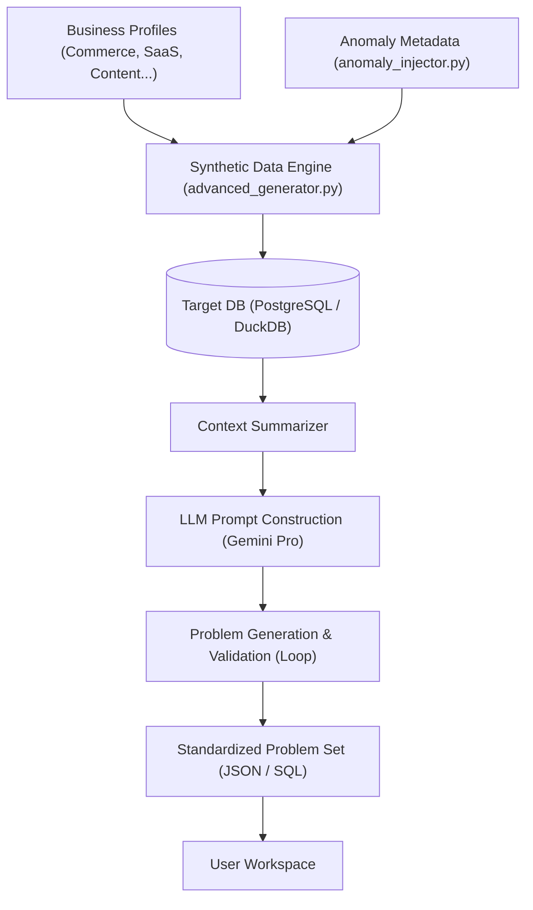

# QueryCraft Core Engine: Data & Problem Generation

QueryCraft의 핵심은 **"현장감 있는 데이터"**와 **"이를 분석하는 문제"**를 자동으로 생성하는 결합 구조에 있습니다. 단순히 랜덤한 데이터를 만드는 것이 아니라, 비즈니스 논리에 기반한 시뮬레이션 엔진을 통해 실제 기업의 DB와 유사한 환경을 구축합니다.

---

## 🏗️ 전체 아키텍처 (Generation Pipeline)

---

## 1. 데이터 생성 엔진 (Synthetic Data Engine)
`backend/generator/data_generator_advanced.py`

데이터는 단순 난수가 아닌 **사용자 행동 시나리오**를 기반으로 생성됩니다.

### 📊 비즈니스 프로필 기반 시뮬레이션
`product_config.py`에는 각 산업별 표준 이벤트와 전환율이 정의되어 있습니다.
- **Commerce**: `view_product` → `add_to_cart` → `begin_checkout` → `purchase` 흐름을 확률적으로 시뮬레이션합니다.
- **SaaS**: `login` → `dashboard_view` → `feature_use` (Task 관리 등) → `upgrade_plan` 흐름을 따릅니다.

### 🧨 이상 현상 주입 (Anomaly Injection)
`anomaly_injector.py`는 정상적인 데이터 흐름 속에 의도적인 "장애"를 심습니다.
- **예시**: 특정 채널(`channel='ads'`)의 유입 유저들에 대해 결제 전환율(`purchase`)을 90% 급감시킴.
- 이 메타데이터는 단순 데이터 변경을 넘어, **문제를 생성할 때 "원인을 분석하라"는 특별한 지시어**로 사용됩니다.

---

## 2. 문제 생성 엔진 (Problem Generation & Validation)
`problems/generator.py`

데이터가 준비되면, AI가 이를 보고 분석 문제를 출제합니다.

### 🧠 Context-Aware Prompting
단순히 "문제를 만들어줘"라고 하지 않습니다. AI에게 다음 정보를 주입합니다.
- **테이블 스키마**: 현재 생성된 DB의 정확한 컬럼명과 타입 정보.
- **데이터 요약**: "오늘 커머스 데이터에는 리텐션이 급감한 이상 현상이 포함되어 있음"과 같은 힌트.
- **KPI 가이드**: 각 비즈니스 모델에서 중요하게 여겨지는 지표(DAU, GMV, Churn Rate 등) 정의.

### 🔄 Double-Loop Validation (검증 루프)
AI가 만든 문제가 실제로 풀 수 있는 문제인지 확인하기 위해 **내부 검증**을 거칩니다.
1.  **AI 제안**: Gemini가 문제 설명, 힌트, 그리고 **정답 SQL**을 생성합니다.
2.  **실행 테스트**: 백엔드가 방금 생성된 **정답 SQL을 실제 DB에서 즉시 실행**해봅니다.
    - 실행 에러가 나거나 결과가 0건이면 문제를 폐기하고 재생성합니다.
3.  **기대 결과 저장**: 실행이 성공하면 그 **결과(Expected Result)**를 문제와 함께 저장합니다. 사용자가 제출한 쿼리 결과와 이 데이터를 비교하여 채점합니다.

---

## 3. 핵심 파일 요약

| 파일 | 역할 | 핵심 특징 |
| :--- | :--- | :--- |
| `product_config.py` | 비즈니스 로직 정의 | 커머스, 핀테크, 커뮤니티 등 각 필드의 지표 및 이벤트 확률 관리 |
| `data_generator_advanced.py` | 대량 데이터 생성 | `COPY` 명령어를 사용하여 로컬/클라우드 DB에 수만 건의 데이터를 고속 적재 |
| `anomaly_injector.py` | 시나리오 메타데이터 생성 | RCA(원인 분석)를 위한 구체적인 장애 상황 설계 및 주입 |
| `problems/generator.py` | 문제 라이프사이클 관리 | LLM 호출, SQL 검증, DB/파일 저장 연동 |
| `problems/prompt_pa.py` | 도메인 특화 프롬프트 | 제품 분석가(PA)의 사고방식을 복제하도록 AI를 튜닝하는 템플릿 |

---

> [!TIP]
> **왜 이렇게 복잡하게 만드나요?**  
> 고정된 데이터셋으로 공부하면 정답을 외우게 되지만, 매일 비즈니스 모델이 바뀌고 이상 데이터가 새로 주입되는 환경에서는 **진짜 분석가처럼 데이터를 탐색하는 능력**을 기를 수 있기 때문입니다.
