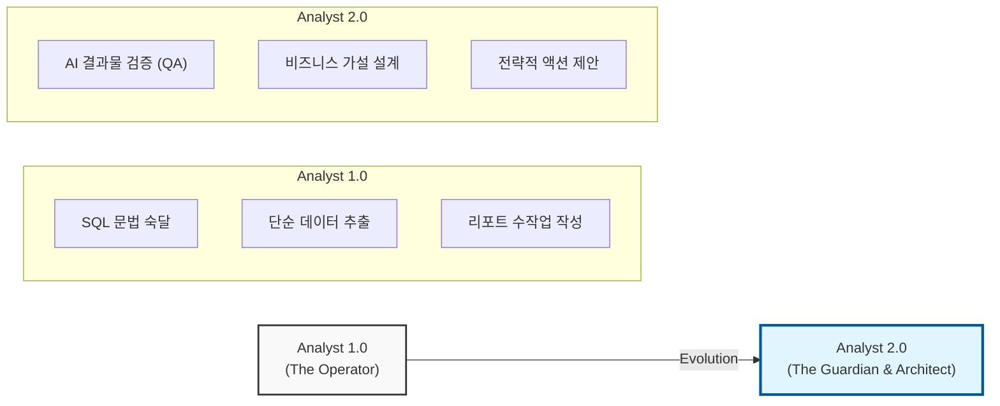

# QueryCraft Future Vision & Strategy

> **목적**: QueryCraft의 장기적인 서비스 비전, AI 기반 기능 로드맵, 그리고 AI 시대를 맞이하는 데이터 분석가의 진화 전략을 담은 통합 가이드입니다.

---

## 🚀 1. 서비스 비전

QueryCraft는 단순한 SQL 실습 플랫폼을 넘어, **AI 기반 분석 실무 시뮬레이션 플랫폼**으로 진화합니다. 분석가가 실제 비즈니스 환경에서 겪는 문제들을 AI와 함께 해결하며 실무 역량을 쌓을 수 있는 환경을 제공합니다.

### 핵심 목표

- **실무형 AI 협업 경험**: AI를 도구가 아닌 파트너로 인식하고 제어하는 역량 강화.
- **분석적 사고의 확장**: 단순 추출을 넘어 문제 정의부터 원인 규명까지의 전 과정 내재화.
- **Decision Science로의 관문**: 데이터 기반의 합리적 의사결정을 주도하는 인재 육성.

---

## 🗺️ 2. AI 기능 로드맵

### 2.1 RCA (Root Cause Analysis) 시나리오 고도화

- **비전**: 실무 장애 상황(매출 급감, 리텐션 하락 등)을 시나리오화하여 대응 역량 강화.
- **핵심 요소**: AI가 매일 새로운 이상 데이터와 시나리오를 자동 생성. 사용자는 SQL로 가설을 검토하고 원인을 규명.

### 2.2 AI 인사이트 리포트 자동화 (Upcoming)

- **비전**: SQL 실행 결과를 비즈니스 언어로 해석하여 보고서 초안 자동 생성.
- **핵심 요소**: Key Findings, Action Items, 추가 분석 제안을 구조화하여 리포팅 시간 단축.

### 2.3 개인화 학습 추천 (Adaptive Learning) (Backend Ongoing)

- **비전**: 사용자 오답 패턴 분석을 통한 맞춤형 학습 경로 제공.
- **핵심 요소**: 약점 영역(JOIN, Aggregation 등) 집중 학습 및 난이도 자동 조절.

### 2.4 Text-to-SQL 보조 도구 (Upcoming)

- **비전**: 자연어 질문을 SQL 초안으로 변환하여 실무 생산성 극대화.
- **핵심 요소**: 스키마 매핑 기반 SQL 생성 및 분석 로직 학습 가이드.

### 2.5 MCP (Model Context Protocol) 연동 (Future)

- **비전**: AI 에이전트가 실제 DB 스키마와 데이터 분포를 실시간으로 인지하여 초정밀 가이드 제공.
- **핵심 요소**: Cursor IDE, Claude Desktop 등 외부 도구와의 연동성 확보.

---

## 📈 3. [Special Report] 분석가 공존 전략: Analyst 2.0

AI 기술의 발전은 분석가의 소멸이 아닌 **비즈니스 임팩트를 극대화하는 역할의 재정의**를 의미합니다.

### 3.1 Analyst 1.0 → 2.0 프레임워크

### 3.2 핵심 공존 전략

#### ① Syntax에서 Logic으로 (From 'How' to 'What')

쿼리의 '구문(How to write)'을 완벽하게 외우는 능력보다, 어떤 데이터를 왜 추출해야 하는지 정교한 '로직(What to ask)'을 설계하는 능력이 중요해집니다. QueryCraft의 Text-to-SQL 기능은 구문 작성을 보조하고, 사용자는 더 깊은 분석 설계에 집중하게 합니다.

#### ② 검증자로서의 분석가 (Analyst as a Guardian)

AI가 생성한 SQL과 인사이트의 오류를 찾아내고 편향을 제거하는 '검증 역량(QA)'이 필수적입니다. AI Lab을 통해 AI의 오답 노트를 분석하고, AI 결과물을 디버깅하며 비판적 사고를 기릅니다.

#### ③ Decision Scientist로의 도약

단순 현상 기술(Descriptive)을 넘어, 실험 설계(A/B Test)와 인과 관계 추론을 통해 비즈니스 임팩트를 직접적으로 만들어내는 인재로 거듭납니다. MCP 연동을 통한 실시간 데이터 실험 환경은 이러한 성장을 지원합니다.

---

## 🛠️ 4. QueryCraft의 모델 구현 방식

| 전략 방향 | 구현 기능 | 기대 효과 |
| :--- | :--- | :--- |
| **Logic over Syntax** | Text-to-SQL Lab | 쿼리 작성 시간 80% 단축, 분석 설계에 집중 |
| **Guardian Competency** | AI Error Debugging Case | AI의 논리적 오류를 찾아내는 비판적 사고 배양 |
| **Strategic Thinking** | RCA Simulation Mode | 복잡한 인과 관계 규명 및 전략적 리포팅 훈련 |
| **Bridge the Gap** | Adaptive Tutor | 개별 AI 활용 스킬 격차 해소 및 맞춤형 성장 지원 |

---

## 5. 결론: 인간과 AI의 시너지

AI는 분석가의 '손'이 되어 생산성을 극대화하고, 분석가는 서비스의 '뇌'가 되어 전략적 방향을 리딩해야 합니다. QueryCraft는 이 과도기를 성공적으로 넘기기 위한 최적의 시뮬레이션 환경이자 훈련소가 될 것입니다.

---
*마지막 업데이트: 2026-01-18*
*Reference: Gartner Top Trends in Data and Analytics for 2025, McKinsey Global Institute Report.*
