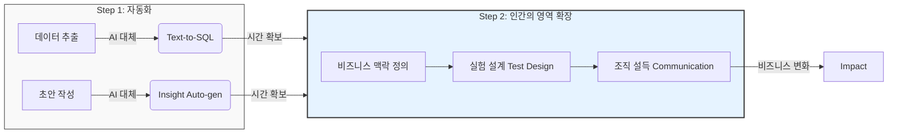

# QueryCraft AI 기능 로드맵 보고서

> **목적**: QueryCraft의 AI 기반 기능 확장 계획과 분석가 관점에서의 활용 가치를 정리한 전략 문서입니다.

---

## Executive Summary

QueryCraft는 SQL 실습 플랫폼에서 **AI 기반 분석 역량 강화 플랫폼**으로 진화하고 있습니다. 본 로드맵은 분석가가 AI를 활용하여 **업무 효율을 높이고, 분석 역량을 증명**할 수 있는 기능들을 제안합니다.

| 기능 | 현재 상태 | 분석가 활용 가치 |
|------|----------|-----------------|
| RCA 시나리오 모드 | 🟡 진행 중 | 장애 대응 역량 증명 |
| AI 인사이트 리포트 | 🔵 대기 | 리포트 작성 자동화 |
| 개인화 학습 추천 | 🔵 대기 | 데이터 기반 의사결정 경험 |
| Text-to-SQL | 🔵 대기 | 데이터 민주화 실현 |
| MCP 연동 | 🔵 대기 | 실시간 데이터 기반 AI 피드백 |

---

## 1. RCA (Root Cause Analysis) 시나리오 모드

### 1.1 기능 개요

**현재 상태**: 🟡 진행 중

RCA 모드는 "매출 급감", "리텐션 하락", "전환율 이상" 등 **가상의 비즈니스 장애 상황**을 설정하고, 사용자가 SQL을 통해 단계별로 원인을 파악하는 학습 모드입니다.

```
[시나리오 예시]
"2025년 12월 셋째 주, 결제 전환율이 전주 대비 35% 하락했습니다.
무엇이 원인인지 분석하고 보고서를 작성해주세요."
```

### 1.2 AI의 역할

| AI 역할 | 설명 |
|---------|------|
| **시나리오 생성** | 매일 다른 원인(특정 채널 효율 저하, 가입 페이지 버그 등)이 담긴 데이터와 시나리오를 자동 생성 |
| **데이터 조작** | 시나리오에 맞게 특정 날짜/세그먼트에 이상 패턴을 삽입 |
| **힌트 제공** | 사용자가 막혔을 때 "이 테이블의 특정 컬럼을 확인해보세요" 형태의 가이드 제공 |
| **정답 검증** | 원인을 정확히 찾았는지 SQL 결과와 논리를 함께 평가 |

### 1.3 분석가에게 왜 필요한가?

#### 실무 장애 대응 역량 증명
- 실제 회사에서 발생하는 **장애 상황을 시뮬레이션**하여 대응 역량을 훈련
- "이상 징후 감지 → 가설 설정 → 데이터 검증 → 원인 규명" 프로세스 체화
- 면접에서 **"장애 대응 경험이 있나요?"** 질문에 구체적 사례 제시 가능

#### 포트폴리오 구축
- RCA 분석 리포트를 포트폴리오로 활용
- "가상 시나리오지만 실무와 동일한 방법론으로 분석"이라는 스토리텔링

### 1.4 분석가가 AI를 활용하면 할 수 있는 것

| 활용 사례 | 설명 |
|----------|------|
| **장애 패턴 학습** | 반복적인 RCA 훈련을 통해 다양한 장애 유형과 원인 패턴을 학습 |
| **분석 템플릿 획득** | AI가 제시하는 접근 방법을 통해 체계적인 분석 프레임워크 습득 |
| **가설 검증 훈련** | 데이터를 통해 가설을 증명/반증하는 논리적 사고력 강화 |
| **보고서 작성 연습** | 발견한 원인과 영향도를 정량적으로 정리하는 리포팅 역량 개발 |

---

## 2. AI 인사이트 리포트 자동화

### 2.1 기능 개요

**현재 상태**: 🔵 대기

SQL 실행 결과 데이터를 AI에게 전달하여 **비즈니스 인사이트**와 **Action Plan**을 자동 생성하는 기능입니다.

```
[사용 플로우]
1. 사용자가 SQL 실행 → 결과 테이블 출력
2. "AI 인사이트 보기" 버튼 클릭
3. AI가 결과를 분석하여 인사이트 리포트 생성
```

### 2.2 AI의 역할

| AI 역할 | 설명 |
|---------|------|
| **데이터 해석** | 숫자 데이터에서 의미 있는 패턴과 트렌드 발견 |
| **비교 분석** | 기간별, 세그먼트별 비교를 통한 인사이트 도출 |
| **리포트 생성** | 핵심 발견(Key Findings), 추천 액션(Action Items), 추가 분석 제안을 구조화된 형태로 출력 |
| **비즈니스 언어 변환** | 기술적 분석 결과를 비즈니스 의사결정자가 이해할 수 있는 언어로 번역 |

### 2.3 분석가에게 왜 필요한가?

#### 리포트 작성 시간 단축
- 데이터 추출 후 **인사이트 도출 및 보고서 작성**에 소요되는 시간이 50% 이상 차지
- AI가 초안을 작성해주면 분석가는 **검토 및 정교화**에 집중 가능

#### 분석 품질 향상
- AI가 제시하는 다양한 관점을 통해 **놓칠 수 있는 인사이트** 발견
- 일관된 포맷의 리포트 생성으로 **표준화된 분석 산출물** 제공

#### 데이터 해석 역량 증명
- 단순 SQL 작성을 넘어 **비즈니스 인사이트 도출** 역량 보유 증명
- AI를 활용한 분석 자동화 경험 = 실무에서 효율적인 분석가

### 2.4 분석가가 AI를 활용하면 할 수 있는 것

| 활용 사례 | 설명 |
|----------|------|
| **리포트 초안 자동 생성** | 쿼리 결과를 즉시 보고서 형태로 변환하여 작성 시간 80% 단축 |
| **다각도 분석 제안** | AI가 추가 분석 방향을 제안하여 분석의 깊이 확보 |
| **비즈니스 맥락 연결** | 숫자에 담긴 의미를 비즈니스 언어로 해석하는 훈련 |
| **액션 아이템 도출** | 데이터 인사이트를 실제 비즈니스 액션으로 연결하는 역량 개발 |

---

## 3. 개인화 학습 추천 (Adaptive Learning)

### 3.1 기능 개요

**현재 상태**: 🔵 대기

사용자의 활동 기록(틀린 문제, 풀이 시간, SQL 패턴)을 분석하여 **맞춤형 학습 경로**를 제공하는 기능입니다.

```
[추천 예시]
"최근 JOIN 관련 문제에서 오답률이 높습니다.
다음 문제는 JOIN 기초부터 다시 연습해보세요."
```

### 3.2 AI의 역할

| AI 역할 | 설명 |
|---------|------|
| **약점 분석** | 사용자의 오답 패턴, 풀이 시간, SQL 구문 분석을 통해 약점 영역 파악 |
| **학습 경로 설계** | 약점을 보완하기 위한 최적의 문제 순서 결정 |
| **난이도 조정** | 사용자 수준에 맞는 난이도의 문제 추천 |
| **피드백 생성** | 왜 이 문제를 추천하는지에 대한 설명 제공 |

### 3.3 분석가에게 왜 필요한가?

#### 효율적인 역량 개발
- 이미 잘하는 영역에 시간 낭비 없이 **약점 영역에 집중** 학습
- 개인별 맞춤 학습으로 **빠른 역량 향상** 달성

#### 데이터 기반 의사결정 경험
- 자신의 학습 데이터를 기반으로 한 추천 시스템을 직접 경험
- **개인화 추천 시스템의 작동 원리** 체득 → 실무에서 유사 시스템 설계 시 활용

#### 자기 객관화
- AI가 분석한 약점 리포트를 통해 **객관적인 역량 현황** 파악
- 면접에서 "본인의 약점이 무엇인가요?"에 데이터 기반 답변 가능

### 3.4 분석가가 AI를 활용하면 할 수 있는 것

| 활용 사례 | 설명 |
|----------|------|
| **약점 기반 학습** | AI가 발견한 약점 영역 집중 보완으로 학습 효율 극대화 |
| **학습 진도 최적화** | 너무 쉽거나 어려운 문제 건너뛰기로 시간 효율 증가 |
| **성장 추적** | 시간에 따른 약점 개선 추이를 시각화하여 성과 확인 |
| **추천 시스템 이해** | 개인화 추천 로직을 직접 경험하여 유사 시스템 설계 역량 획득 |

---

## 4. Text-to-SQL 보조 도구

### 4.1 기능 개요

**현재 상태**: 🔵 대기

자연어 질문을 SQL 초안으로 변환해주는 에디터 기능입니다.

```
[사용 예시]
자연어: "지난 주 대비 이번 주 DAU가 얼마나 변했어?"

→ AI 생성 SQL:
SELECT 
    CASE WHEN event_date >= DATE_SUB(CURRENT_DATE, 7) THEN 'this_week' ELSE 'last_week' END AS week,
    COUNT(DISTINCT user_id) AS dau
FROM events
WHERE event_date >= DATE_SUB(CURRENT_DATE, 14)
GROUP BY 1
```

### 4.2 AI의 역할

| AI 역할 | 설명 |
|---------|------|
| **질문 해석** | 비즈니스 질문의 의도와 맥락 파악 |
| **스키마 매핑** | 질문에 해당하는 테이블과 컬럼 자동 식별 |
| **SQL 생성** | 문법적으로 올바른 SQL 쿼리 초안 작성 |
| **설명 제공** | 생성된 SQL의 각 부분이 어떤 역할을 하는지 주석 추가 |

### 4.3 분석가에게 왜 필요한가?

#### 분석 속도 향상
- 복잡한 쿼리를 처음부터 작성하는 대신 **AI 초안을 수정**하여 시간 단축
- 반복적인 보일러플레이트 코드 작성 시간 제거

#### 데이터 민주화 실현
- 비개발 직군도 자연어로 데이터 질문 가능
- 분석가는 **다른 팀의 데이터 요청을 AI가 대신 처리**하도록 환경 구축 가능

#### 학습 도구
- AI가 생성한 SQL을 분석하며 새로운 쿼리 패턴 학습
- "이런 질문은 이렇게 접근하는구나" 인사이트 획득

### 4.4 분석가가 AI를 활용하면 할 수 있는 것

| 활용 사례 | 설명 |
|----------|------|
| **쿼리 초안 자동 생성** | 자연어로 질문을 입력하면 SQL 초안이 즉시 생성 |
| **복잡한 쿼리 학습** | AI가 생성한 윈도우 함수, 서브쿼리 등 고급 문법 학습 |
| **비개발자 지원** | PM, 마케터 등의 데이터 요청을 AI가 SQL로 변환하도록 가이드 |
| **데이터 민주화 경험** | 조직 내 데이터 접근성 향상 프로젝트 경험으로 활용 |

---

## 5. MCP (Model Context Protocol) 연동

### 5.1 기능 개요

**현재 상태**: 🔵 대기

MCP는 AI가 **실제 데이터베이스의 스키마와 데이터에 접근**하여 더 정확한 가이드를 제공할 수 있게 해주는 프로토콜입니다.

```
[기존 AI]
"아마 users 테이블에 signup_date 컬럼이 있을 거예요"

[MCP 연동 후]
"pa_users 테이블의 signup_at 컬럼을 확인해보세요.
현재 데이터에는 2025-11-01부터 2025-12-31까지의 데이터가 있습니다."
```

### 5.2 AI의 역할

| AI 역할 | 설명 |
|---------|------|
| **실시간 스키마 조회** | 실제 테이블의 컬럼명, 타입, 제약 조건 확인 |
| **데이터 프리뷰** | 테이블의 샘플 데이터를 조회하여 데이터 분포 파악 |
| **쿼리 검증** | 사용자 쿼리의 실행 계획(EXPLAIN) 분석으로 성능 피드백 |
| **정확한 힌트** | 데이터에 근거한 구체적인 가이드 제공 |

### 5.3 분석가에게 왜 필요한가?

#### 실무 환경과 동일한 경험
- 가상 데이터가 아닌 **실제 데이터 상황을 인지한 AI 피드백**
- "쿼리는 맞지만 해당 날짜에 데이터가 없습니다" 같은 **실질적인 가이드**

#### 학습 효율 극대화
- 추측 기반이 아닌 **데이터 기반 힌트**로 정확한 방향 제시
- 불필요한 시행착오 감소

#### 외부 도구 연동
- Cursor IDE, Claude Desktop 등에서 **브라우저 없이 직접 문제 풀기**
- 개발 환경에서 벗어나지 않고 학습 가능

### 5.4 분석가가 AI를 활용하면 할 수 있는 것

| 활용 사례 | 설명 |
|----------|------|
| **실시간 데이터 확인** | AI에게 "이 테이블에 어떤 데이터가 있어?"라고 물으면 즉시 확인 |
| **쿼리 성능 피드백** | 실행 전에 쿼리의 성능 문제점 사전 파악 |
| **데이터 존재 여부 확인** | 쿼리 작성 전 필요한 데이터가 있는지 AI가 미리 확인 |
| **IDE 통합 학습** | 코딩 에디터에서 직접 SQL 문제를 풀고 채점받는 원스톱 환경 |

---

## 종합: 미래의 데이터 분석가와 AI의 공존 전략

### 1. 업무의 본질적 변화 (Shift in Value)

AI 기술의 도입은 데이터 분석가의 업무를 **'생산(Creation)'**에서 **'설계(Design)와 검증(Validation)'**으로 이동시키고 있습니다. 단순 반복 업무가 자동화될 때, 분석가의 가치는 **비즈니스 임팩트 창출**에 집중됩니다.

| 영역 | 기존 분석가 (Analyst 1.0) | 미래의 분석가 (Analyst 2.0) | QueryCraft 훈련 포인트 |
|:---:|:---|:---|:---|
| **SQL/코딩** | 문법을 외워서 직접 작성 (Syntax Focus) | **AI 초안을 검증하고 최적화 (Logic Focus)** | Text-to-SQL + MCP를 통한 검증 훈련 |
| **리포팅** | "무슨 일이 있었나?" 현황 정리 (Descriptive) | **"그래서 무엇을 해야 하나?" 액션 제안 (Prescriptive)** | AI 인사이트 리포트 생성 및 해석 |
| **문제 해결** | 데이터가 주어지면 분석 시작 | **비즈니스 문제를 정의하고 가설 설계** | RCA 시나리오 모드 (원인 추론) |
| **역할** | 데이터 추출기 (Data Extractor) | **의사결정 설계자 (Decision Architect)** | 개인화 추천 시스템 로직 경험 |

### 2. 자동화 그 이후의 Step: Decision Scientist

단순 업무가 AI로 대체된 후, 분석가는 다음 단계로 나아가야 합니다.



#### Step 1: 효율화 (Efficiency)
- 남들보다 압도적으로 빠르게 데이터를 추출하고 리포트를 만듭니다.
- **QueryCraft 활용**: AI 도구를 능숙하게 다루는 법을 익혀 '도구의 지배자'가 됩니다.

#### Step 2: 고도화 (Extension)
- 확보된 시간을 **'왜(Why)?'**를 고민하는 데 씁니다.
- 단순 지표 확인이 아니라, **인과 관계(Causality)**를 밝히고 **실험(A/B Test)**을 설계합니다.
- **QueryCraft 활용**: RCA 모드에서 정답(SQL)보다 **논리적 추론 과정**을 연습합니다.

### 3. 결론: "준비된 인재"의 정의

이 로드맵이 지향하는 분석가는 단순히 AI 기능을 쓰는 사람이 아닙니다.

> **"AI가 코딩을 대신하는 시대에, 비즈니스의 본질을 꿰뚫고 올바른 질문을 던질 줄 아는 사람"**

QueryCraft는 이러한 **Next-Step 분석가**가 되기 위한 실전 시뮬레이션 필드입니다. 여기서 겪은 시행착오는 미래의 실무에서 가장 강력한 무기가 될 것입니다.

---

*이 로드맵은 사용자 요청에 따라 상시 업데이트됩니다.*
*마지막 업데이트: 2026-01-15*
