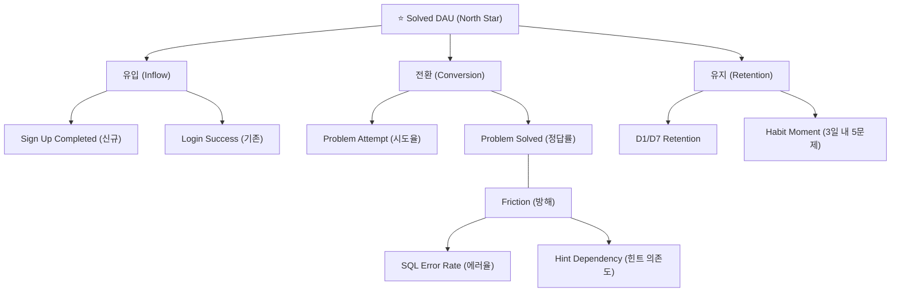

# 프로덕트 분석 트래킹 마스터 가이드 (KPI Tracking Plan)

이 문서는 SQL Labs 서비스의 성장 지표를 정의하고, 이를 측정하기 위한 트래킹 설계 및 관리 방법을 다루는 **데이터 거버넌스 가이드**입니다. 신입 기획자부터 시니어 개발자까지 데이터 흐름을 한눈에 이해할 수 있도록 설계되었습니다.

---

## 1. 분석 전략 (Strategy)

### 1.1 북극성 지표 (North Star Metric)
제품이 사용자에게 주는 가치와 비즈니스의 성장을 동시에 나타내는 가장 핵심적인 지표입니다.

*   **성장 단계 (유저 활성화)**: `Solved DAU`
    *   **정의**: 하루 동안 문제를 1회 이상 완결(Solved)한 고유 사용자 수
    *   **이유**: 단순히 방문하는 것보다 실질적인 학습 경험을 하는 것이 서비스의 핵심 가치이기 때문입니다.

### 1.2 KPI 트리 구조
북극성 지표를 달성하기 위해 쪼개어 관리하는 하위 지표들입니다.



---

## 2. 트래킹 설계 (Design)

### 2.1 이벤트 명명 규칙 (Taxonomy)
*   **Event Name**: `Object + Action` 형태의 **Title Case**를 사용합니다. (예: `Problem Viewed`)
*   **Property Name**: `snake_case`를 사용하며 의미가 명확해야 합니다.
    *   예: `attempt_count` (시도 횟수), `time_spent_sec` (소요 시간)

### 2.2 핵심 유저 여정 (Funnel)
사용자가 문제를 해결하기까지의 표준 경로입니다.

1.  **Problem Viewed**: 어떤 문제들이 있는지 탐색 (View)
2.  **Problem Attempted**: 문제 풀이 시작 - 첫 쿼리 입력 또는 실행 (Attempt)
3.  **Problem Submitted**: 정답 여부 확인 시도 (Submit)
4.  **Problem Solved**: 최종 성공 - 핵심 지표 달성 (Solve)

---

## 3. 구현 상세 가이드 (Implementation)

개발자가 실제 코드에 트래킹을 심을 때 참고하는 핵심 섹션입니다.

### 3.1 중앙 제어 서비스: [analytics.ts](../frontend/src/services/analytics.ts)
모든 트래킹 로직은 이 파일에 캡슐화되어 있습니다. 직접 외부 라이브러리(Mixpanel)를 호출하지 않고 이 싱글톤 객체를 사용해야 데이터 정합성이 유지됩니다.

```typescript
// analytics.ts 내부 구조 예시
class Analytics {
  // 1. 이벤트 트래킹
  public track(event: AnalyticsEvent, props?: EventProperties) {
    if (this.debugMode) console.log(`[Analytics] ${event}`, props);
    window.mixpanel?.track(event, { ...props, env: getEnvironment() });
  }

  // 2. 래퍼 메서드 (타입 안정성 보장)
  public problemSolved(problemId: string, props: EventProperties) {
    this.track('Problem Solved', { problem_id: problemId, ...props });
  }
}
```

### 3.2 사용자 식별 및 프로필: [AuthContext.tsx](../frontend/src/contexts/AuthContext.tsx)
서비스 로그인 시점에 사용자를 유일한 ID로 매칭하고 특성을 부여하는 과정입니다.

```typescript
// AuthContext.tsx 내부 logic
useEffect(() => {
    if (user) {
        // 관리자 계정인 경우 콘솔에 분석 로그 노출 (디버깅용)
        analytics.setDebugMode(!!user.is_admin);
        
        // 믹스패널 유저 프로필 생성 및 업데이트
        analytics.identify(user.id, {
            email: user.email,
            user_type: user.is_admin ? 'admin' : 'free',
            signup_date: user.created_at,
            current_level: user.level,
            total_problems_solved: user.xp // 경험치 등으로 대체 가능
        });
    }
}, [user]);
```

### 3.3 실제 액션 트래킹: [Workspace.tsx](../frontend/src/pages/Workspace.tsx)
유저의 실제 행동(클릭, 실행 등)이 일어나는 시점에 호출합니다.

```typescript
// Workspace.tsx 예시
const handleExecute = async () => {
    // ... 실행 로직
    analytics.sqlExecuted(problemId, {
        sql: sqlText,
        hasError: false,
        dbEngine: 'postgres'
    });
};

const handleSubmit = async () => {
    // ... 제출 및 채점 로직
    if (res.data.is_correct) {
        analytics.problemSolved(problemId, {
            attempt_count: currentAttempt,
            time_spent_sec: timeDiff
        });
    }
};
```

---

## 4. 운영 및 관리 가이드 (Operations)

이 섹션은 데이터 품질을 유지하기 위해 신입 관리자가 반드시 숙지해야 하는 내용입니다.

### 4.1 Mixpanel Lexicon (데이터 사전) 관리
믹스패널 대시보드에서 `Problem Solved`라는 영어 이름 대신 **"문제 정답 해결 (⭐)"**과 같이 예쁜 한글 이름과 설명을 보여주기 위한 설정입니다.

#### **왜 하나요?**
- 프로젝트 구성원 모두가 "이 데이터가 무엇을 의미하는지" 한눈에 알기 위함입니다.
- 대시보드를 처음 보는 사람도 설명을 보고 분석을 시작할 수 있습니다.

#### **단계별 등록 방법 (중요)**
1.  **파일 다운로드**: 프로젝트 내 `docs/` 폴더의 CSV 파일들을 확인합니다.
    - [mixpanel_final_events.csv](./mixpanel_final_events.csv) (이벤트 설명서)
    - [mixpanel_final_properties.csv](./mixpanel_final_properties.csv) (속성 상세 명세)
2.  **믹스패널 접속**: 대시보드 우측 상단 `Data Management` > `Lexicon` 메뉴로 들어갑니다.
3.  **이벤트 등록**: 
    - 상단 **Events** 탭 선택 -> 우측 **Import** 클릭 -> `mixpanel_final_events.csv` 선택
4.  **속성 등록**:
    - 상단 **Event Properties** 탭 선택 -> 우측 **Import** 클릭 -> `mixpanel_final_properties.csv` 선택

### 4.2 트래킹 계획 변경 시 대처법
새로운 기능이 추가되어 이벤트를 새로 쌓아야 한다면?

1.  **기획**: 새 이벤트 이름과 필요한 정보(속성)를 정의합니다.
2.  **개발**: `analytics.ts`에 메서드를 추가하고 프론트엔드 코드에 심습니다.
3.  **자동화**: [gen_lexicon.py](../gen_lexicon.py) 파일의 `events` 또는 `properties` 리스트에 새 항목을 추가합니다.
4.  **갱신**: 터미널에서 `python3 gen_lexicon.py`를 실행하여 CSV 파일을 최신화하고 다시 믹스패널에 업로드합니다.

---

## 5. 분석 용어 사전 (Glossary)

*   **Distinct ID**: 믹스패널이 사용자를 식별하는 고유 값 (우리 서비스의 `user_id`).
*   **Property**: 이벤트와 함께 전송되는 상세 정보 (예: 어떤 문제를 풀었는가?).
*   **Funnel**: 유저가 최종 목표(Purchase, Solve 등)에 도달하기까지 어느 단계에서 가장 많이 이탈하는지 보여주는 그래프.
*   **Habit Moment**: 유저가 서비스의 가치를 깨닫고 '찐팬'이 되는 결정적인 순간 (예: 5문제 이상 해결).
*   **Lexicon**: 데이터의 이름과 의미를 정의해둔 백과사전.
